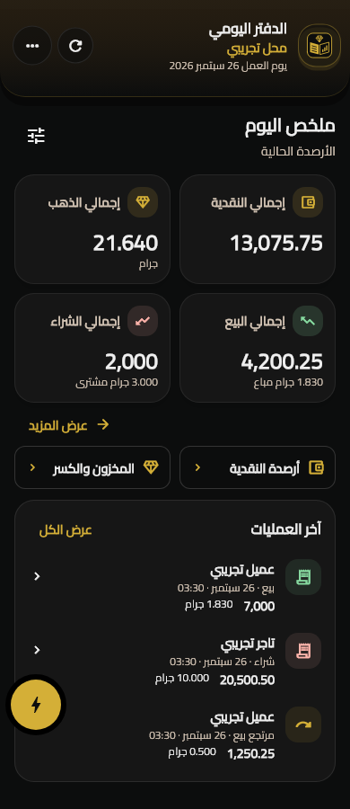
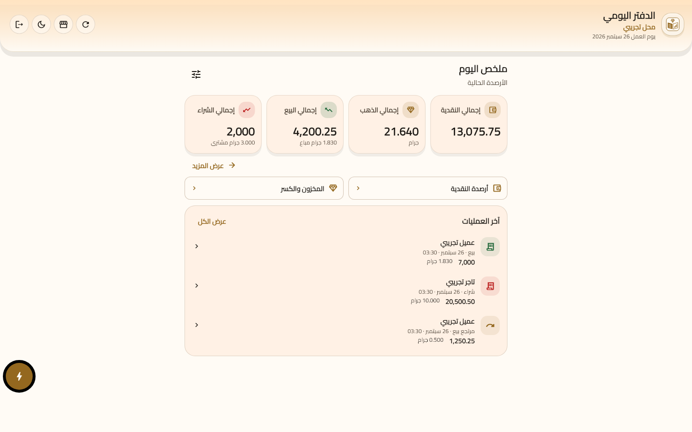

# Compact daily ledger review — 2026-10-05

The owner's request prioritizes important balances, less scrolling and a consistent premium Arabic interface. Home now shows four figures (cash, gold, daily sales and purchases), paired balance-detail links and at most three recent operations. Sales and purchases retain supporting gold weights. Secondary metrics, movement summaries, payment balances, stock, journals and customization open on demand.

## Research and design decisions

Monzo's published home redesign brings balances and recent activity together, with focused views for detail. This informed the bounded activity preview and full-history action. [Monzo home redesign](https://monzo.com/blog/the-new-and-improved-home-screen), [Monzo activity consolidation](https://monzo.com/blog/how-we-unified-our-customers-activity-on-the-new-home-screen).

Revolut's published design update emphasizes easier navigation and account access. This informed the balance-first hierarchy and short paths to detail. These are design adaptations to a gold-shop ledger. [Revolut 10 design](https://www.revolut.com/blog/post/revolut-10/).

The ui-ux-pro-max minimal dashboard guidance and design-system token architecture were applied. Existing Cairo, brown, cream and dark colors remain. Typography uses shared 12/14/16/20/24 roles and tabular figures. Fields share sizes, semantic focus borders and 14-pixel corners across Flutter and React. Exact money and three-decimal gold formatting retain integer/string calculations.

## Interaction and access

- Home height does not grow when loaded history grows from 10 to 200 records.
- Journal filters include all, sale, purchase, return and other. Pagination refreshes the open surface, preserves its filter and disables repeat loads while pending.
- Mobile uses bottom sheets; desktop uses centered dialogs. Both provide one content scroll area and a fixed close control.
- Shop layout preferences remain compatible. Reordering skips metrics that are no longer home figures. Hidden balance shortcuts remain accessible in daily details.
- Removing the owning ledger or switching shops closes open financial details. Existing financial confirmation, retries, audit and authorization contracts remain intact.

## Verification

- Full Flutter suite: 419 tests passed. After final fallback and extra regression coverage, 45 scoped tests passed; the five compact-navigation tests passed again with 200% text scaling above the navigator.
- Flutter analysis: no issues. Scoped Dart formatting and git diff whitespace checks passed.
- React: lint, `npx tsc -b`, and 37 tests across nine files passed.
- Arabic RTL ledger captures reviewed at 320, 390 and 1440 pixels in both themes, including journals and inventory details. Authentication captures reviewed for shared theme effects.
- React authentication reviewed in the in-app browser at 390×844 and 1440×900 in both themes. Inputs use 16px text and tabular figures; no horizontal overflow was observed.
- Screenshots contain synthetic fixtures. Historical review records were preserved. Backend schema and financial contracts did not change, so SQL/RLS gates were not rerun. Native device execution and release/production builds were not run.

## Preview

