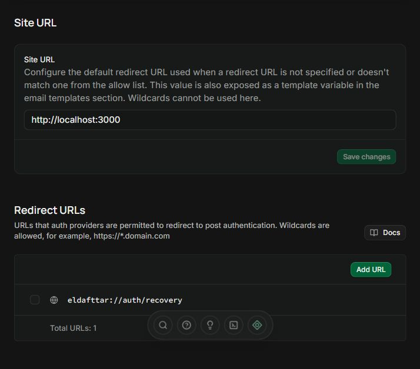
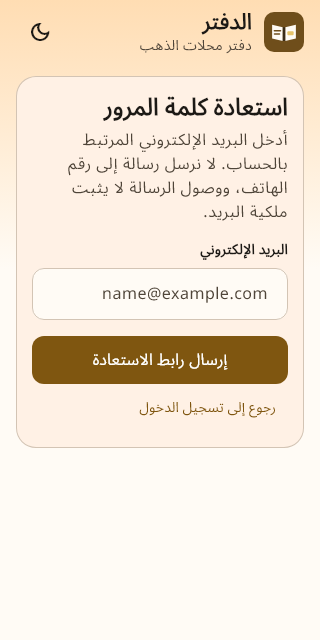
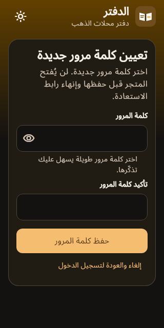
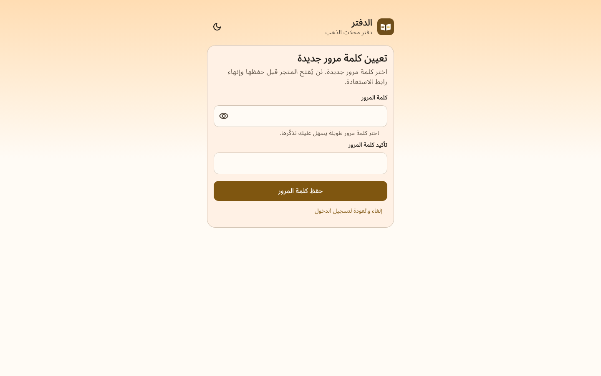
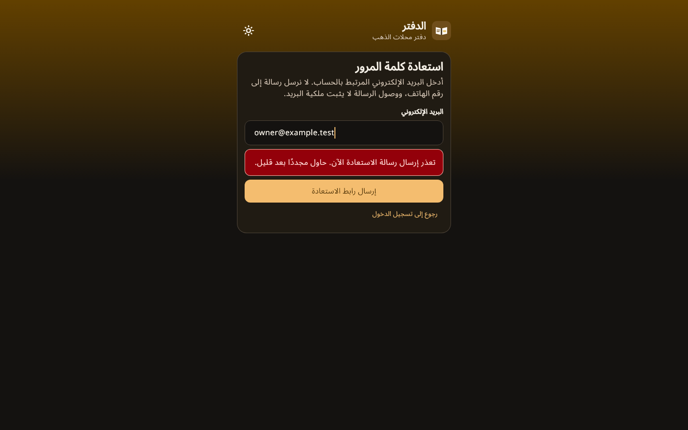

# Arabic workspace and recovery review — 2026-10-04

The brown/cream/dark palette remains governed by [the shared token contract](../../design-system.md). These are synthetic Flutter widget renders, not hosted Auth or signed device acceptance. Historical review directories are unchanged.

Recovery captures cover 320×640 and 1440×900 in light and dark modes. Request/reset forms use a 480-pixel maximum measure, vertical scroll, persistent Arabic labels, 48-pixel controls, password paste/autofill and a visible return/cancel control. Review inspected request at 320/light, reset at 320/dark and 1440/light, and failure at 1440/dark for readable Arabic, wrapping, focus visibility and no overlap. The other states are covered by capture tests in ignored `app/build/recovery-review/`.

The workspace retains daily ledger as its initial destination. Desktop navigation has six destinations; narrow navigation has five, with reports accessible through More. Help resumes the real ledger guide or opens a clearly labeled local sale practice form. Inspected workspace examples are retained here; the backing tests verify RTL, navigation and absence of posting/pending persistence in practice.

Recovery server delivery, native deep-link handling, physical keyboard/screen-reader device behavior and iOS signing are separate checks. The development dashboard now confirms the exact hosted recovery redirect after the user's explicit approval. Inventory/trader screens are not accepted by this review and require their own completed backend, client tests and captures.

## Bounded daily-note restart restoration

The restart restoration subtask now has [its own current validation and 24 retained captures](daily-note-restore/validation.md). Six states were inspected at 320×900 and 1440×900 in Arabic RTL and both themes: local read, status lookup, frozen unknown request, confirmed absence, confirmed success and storage-read failure with retry. The shared palette is unchanged. Final Flutter analysis passed; the full suite passed 375 tests. React lint, 35 tests and TypeScript checking passed. This accepts only client restoration; LED-05 and milestones 0–3 remain open. Hosted notes and native device restart behavior remain separate acceptance checks.
