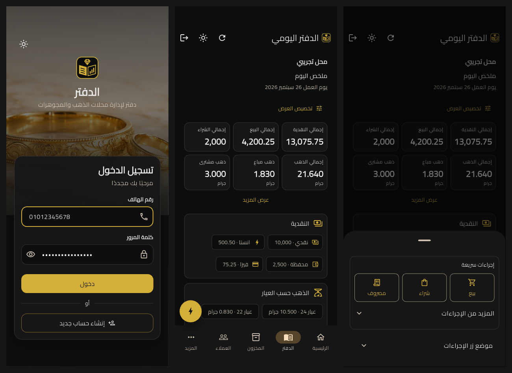

# Owner feedback completion — 2026-10-05

All 14 supplied feedback items and the additional original voice-note requests are implemented locally. This record supersedes the earlier [audit](feedback-audit.md); its historical findings remain intact. All eight PDF pages were reviewed as product references, alongside the two Arabic transcripts and the supplied summary. No source documents, private party data or credentials are included here.

## Comment coverage

| Item | Completed behavior / evidence |
| --- | --- |
| FB-001 | Direct sign-in, the ledger/diamond brand, restrained gold controls, Arabic light/dark layouts and no guides or tours. Native Android auth and responsive Flutter captures reviewed. |
| FB-002 | Signup uses “الاسم” and “اسم المحل”. |
| FB-003 | Separate email and phone fields in registration; login retains its supported single email-or-phone contact field. |
| FB-004 | Package-backed country/phone field, 22 supported Arab-region countries, Arabic country search, automatic dial codes and international paste recognition. Android confirms the flag and dial code render. |
| FB-005 | Egyptian catalog when available; labelled manual region input for other countries or unavailable catalogs. |
| FB-006 | Cairo typography, reference charcoal/black and gold dark palette, cream/brown light palette, compact metrics and progressive business forms. Both clients share semantic theme roles. |
| FB-007 | Separate sale/purchase/return journals. Empty returns stay absent; their visibility preference is independent and persisted. Other movements use a separate sheet. |
| FB-008 | Each of eight metrics can be moved or hidden, including cash and gold. First six visible metrics show initially, with “عرض المزيد”. Per-shop persistence and recovery after hiding totals are tested. Existing section controls remain. |
| FB-009 | Draggable gold floating action button opens the supported quick actions. Its safe position persists per shop; corner buttons provide a keyboard/tap alternative. Android route/menu behavior reviewed. |
| FB-010 | Category → item details → payment → optional details → invoice-style review → confirmed success. Net cash/gold effects are confirmed before posting. |
| FB-011 | Twelve standard choices include rings, bands, bangles, bracelets, anklets and sets; purchases add scrap. Known names/categories are supplied automatically. Only “أخرى” offers optional custom input. |
| FB-012 | Customer name is optional for sales and every purchase, including unpaid purchases. Purchase UI says customer. Each unnamed payable has its own operation identity; posting, replay, separate balances, settlement, returns and shop boundaries are covered by domain/UI/SQL gates. |
| FB-013 | Currency labels removed from UI, financial review, operation sharing and reports. Comma grouping and suppressed `.00` preserve exact cents; gold retains three decimals. Gold-coin category names are preserved. |
| CLF-001 | Reference-inspired open-ledger/diamond logo and invoice-style review, with clear Arabic labels and business information before net financial effects. Operation numbers are server-assigned and appear after confirmation; the pre-save review does not invent an invoice number. |

## Additional transcript and PDF coverage

- Fresh installations start dark; persisted light and system choices remain respected in both clients.
- Cairo is bundled locally for both clients, with its SIL license. Tagline: “دفتر لإدارة محلات الذهب والمجوهرات”.
- Authentication enters the owner's shop and daily ledger directly. Required three-step registration remains; guide, onboarding-tour and practice entry points stay removed.
- Journal cards include the recording owner, item summary and quantity alongside amount, weight, karat, payment and server time. The single owner remains the only authorized actor; no employee roles or invitations were added.
- Compact business cards replace large tables. Payment can be split; pending outcomes retain the original idempotency key and exact payload. Success appears only after server confirmation.
- Mobile and desktop use the same visual roles. Light gold/brown controls keep readable contrast against cream. Unsupported reference actions are not displayed as working controls.

## Validation

- Scoped Dart formatting and Flutter analysis: no issues. Full Flutter suite: **416 passed**; **19 targeted tests passed** after the final system-inset adjustment. New tests cover dragging/clamping/restoring the button, navigation clearance, a tap alternative, per-shop metric order/visibility, return-journal visibility, anonymous unpaid purchase confirmation and exact item-count decoding.
- React lint, **37 tests** and TypeScript project checking passed. Fresh dark mode and persisted choices are covered.
- Owner-registration Deno tests: **23 passed**.
- All migrations replayed into a fresh named disposable PostgreSQL 17 database. All **ten SQL identity/RLS/registration/opening/trade/pricing/inventory suites** passed. The daily-notes/pagination suite also passed, including expired-session, cross-owner and bounded-feed checks. Its expiry fixture now uses transaction time so a long setup cannot make an intended expired session valid.
- Android emulator debug integration tests: auth **1 passed**, ledger/menu/category review **1 passed**. All use synthetic gateways and data. The auth screenshots confirm native country-flag rendering; ledger screenshots include production workspace navigation and the floating button.
- Arabic RTL visuals reviewed in both themes at 320, 390 and 1440 Flutter widths, native Android phone dimensions and 390/1440 React widths. Numeric card wrapping found in review was fixed. Native splash assets were regenerated. No release or React production builds were run.
- Source-reference exclusion, local links, asset privacy and `git diff --check` reviewed.

## Evidence and visual acceptance

[Updated screenshots](completion-screens) contain rendered application evidence, not generated mockups. [Android signup](completion-screens/android-auth-signup-top-dark.png) confirms the phone package; [quick actions](completion-screens/android-quick-actions-dark.png), [journal cards](completion-screens/ledger-journals-dark-390.png), [sale review](completion-screens/trades-sale-review-dark-390.png) and [light ledger](completion-screens/android-ledger-light.png) cover the critical changes.

The implementation follows the supplied direction while retaining required financial safeguards and backend-supported actions. Final owner visual acceptance is still a product review. iOS and Windows native runtime behavior and hosted Supabase Auth were not newly verified; desktop evidence comes from Flutter rendering and the React browser review.

## Backend rollout

Changes remain local and are not deployed. Before releasing the client, apply `20261005071930_owner_feedback_registration_and_ledger.sql`, deploy the updated `owner-register` function, and apply `20261005091822_complete_owner_feedback.sql`. The latter permits unnamed purchase payables and supplies journal item/count summaries without changing atomicity, authorization, audit timestamps or idempotency. Legacy servers can omit the optional summary fields, but require the new migration to accept unnamed unpaid purchases.

Font source: [official Cairo font](https://github.com/google/fonts/tree/main/ofl/cairo). License copies accompany the Flutter and React assets. Historical evidence remains unchanged.
