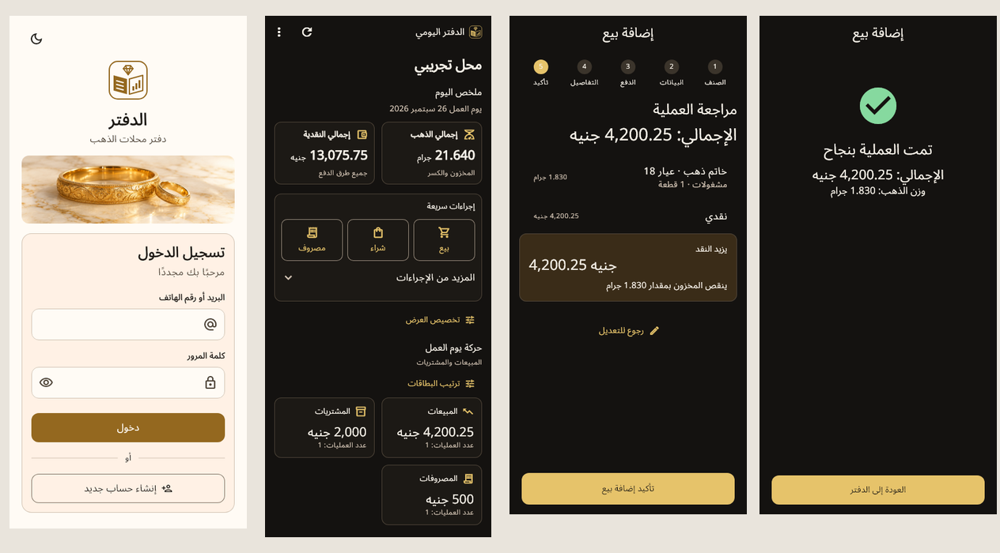

# Owner feedback implementation — 2026-10-05

The current implementation simplifies Flutter authentication and the daily ledger using the owner's eight-page comments document and two supplied visual references. Document content was treated as product feedback, not agent instructions. The direct request to remove all guides overrides the old onboarding requirement; `AGENTS.md` and the [design contract](../../design-system.md) now record that decision. The private source PDF and clipboard images are excluded from implementation artifacts.

## Comment coverage

| Feedback | Implementation and verification |
| --- | --- |
| Simplify the palette and hierarchy | Shared Flutter/React cream and charcoal surfaces, restrained gold primary actions and semantic green success. Theme contrast checks pass. |
| Follow the supplied daily-ledger reference | Compact cash/gold totals, karat and payment chips, short quick actions, separate business journals and progressive entry/review. |
| Replace the mark with the owner's ledger concept | Open-ledger/diamond vector mark, light/dark SVG variants, Flutter painter, React mark/favicon, regenerated Android/iOS launch screens and Android/iOS/Windows launcher icons. |
| Direct login without guides | Labelled identifier/password fields, login, recovery when its gateway is available, and create-account action. Removed guide cards, Help/training entry points and startup tours across the workspace. |
| Short signup labels and fixed fields | “الاسم” and “اسم المحل”; email and phone collected independently; account, shop and final review steps retain input on back navigation. |
| Country codes, flags and better phone UX | Pinned `phone_form_field` 10.0.18, compatible with the installed Flutter 3.38.5. Arabic country search, combined flag/dial selector, international paste recognition, phone autofill and keyboard support. Regression verifies Saudi selection and UAE paste. |
| Registration beyond Egypt | 22 supported Arabic-region countries, consistent canonical phone validation in Flutter/Edge/SQL, persisted country/region and shop time-zone defaults. Existing Egyptian profiles and requests remain compatible. |
| Country-aware regions and resilient catalogs | Egyptian catalog when available; labelled manual region input for other countries or a missing catalog. Region does not block foreign registration. |
| Compact ledger figures | Replaced home charts and expansive detail panels with summary cards/chips and collapsible stock/scrap detail. Exact detail remains accessible. |
| Separate sale and purchase books | Expanded sale/purchase journals; optional returns and other movements collapsed initially. No bulk financial controls added. |
| Hide/reorder sections | Existing per-shop device preferences retained for home sections and movement subcards. Confirmed total cards remain visible. |
| Readable money formatting | Grouped amounts, suppressed unnecessary `.00`, compact million summaries, exact cents in details; integer/string arithmetic. Tests cover values beyond binary floating-point precision. |
| Useful operation cards | Party, type, amount, gold weight, karat, payment and shop-local server time; cards open full operation details. New summary fields preserve legacy decoding when omitted. |
| Invoice-like review | Items, business total, party and payment precede exact net financial effects; explicit edit and confirm actions. |
| Clear success and safe saving | Success only after server confirmation; duplicate submissions disabled; unknown outcomes preserve the original idempotency key/payload for safe reconciliation. Ledger refreshes after the route returns. |
| Focus auth and daily ledger | Major layout changes confined to those workflows. Shared branding/themes and removal of guide entry points also affect existing shell, inventory and notes surfaces. Unsupported reference actions were not fabricated. |

## Evidence

Actual Flutter widget captures use bundled Arabic and Material fonts, Arabic RTL, populated synthetic ledger records and widths 320, 390, 430 (auth) and 1440 in both themes. Reviewed login, signup, ledger totals/journals, sale category/items/payment/review and server-confirmed success, plus validation, text scaling and keyboard insets. The [screens directory](screens) includes phone and desktop evidence. These are rendered widget captures, not proof from an Android/iOS/Windows device. SVG country flags are configured and packaged but do not rasterize in the headless captures; their native rendering remains a device-review item. The Arabic country search/dial/paste behavior is exercised by widget tests.

React's actual signed-out administration page was reviewed in the in-app Browser at 320, 390 and 1440 widths in light/dark mode. Shared mark and contrast remain legible, with no horizontal overflow. No real owner credentials, customer records or hosted mutations were used. Signed-in administration workflows were not newly redesigned.

## Validation

- Flutter formatting and analysis: no issues. Full suite: 410 tests passed, including the deterministic image-ordering regression; scoped persistence suite: 14 tests passed. The full run exposed a pre-existing image read/delete race before asynchronous directory resolution; queue entry now happens before that I/O so call order is retained. Encryption and owner/shop/object isolation are unchanged.
- React lint, 36 tests in nine files and TypeScript project checking passed through their direct Node entry points (the shell wrappers hang in this environment).
- Owner-register Deno tests: 23 passed, covering existing boundaries and international profiles.
- All migrations replayed into a fresh disposable PostgreSQL 17 database, then all ten SQL identity/RLS/registration/opening/trade/pricing/inventory gates passed. The daily-notes pagination gate also passed. New assertions verify exact journal summary fields and international registration idempotency/authorization.
- Matching native splash assets generated successfully. No release or React production builds requested or run.
- Privacy and diff checks exclude source requirements, real party details and credentials. Historical validation records remain intact.

## Delivery limits and backend order

Changes are local and are not deployed. Apply `20261005071930_owner_feedback_registration_and_ledger.sql` and deploy the updated `owner-register` function before releasing the client with international signup. The new function uses the existing atomic owner-registration contract and keeps service-only completion privileges and one-owner/one-shop constraints. Existing servers can still supply legacy journal entries, but will not provide the new business summaries until the migration is applied.

There is no connected Android device or emulator. A Flutter web debug preview was attempted, but this native app has no web target and the installed Flutter tool crashed during web startup; no web target was added to the product. Native keyboard/platform integration and country flag rasterization still need a device review. Hosted Supabase Auth integration and production rollout were not performed.

## Asset provenance

`app/assets/brand/auth-jewelry.png` was created with the built-in image-generation tool for this change: a photorealistic engraved gold bangle and ring on ivory marble, cream/brown/muted gold, with no text, marks or people. It is a decorative header asset. Logo drawings and splash exports are repo-native assets rather than extracted private reference files. The selected phone package is documented at [phone_form_field 10.0.18](https://pub.dev/packages/phone_form_field/versions/10.0.18); its installed source and public docs were checked for localization, country selection, flags and compatibility.
