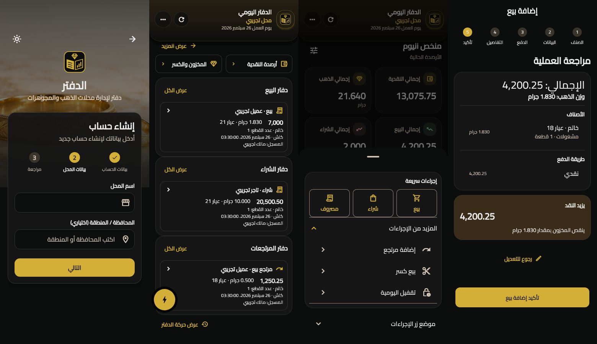
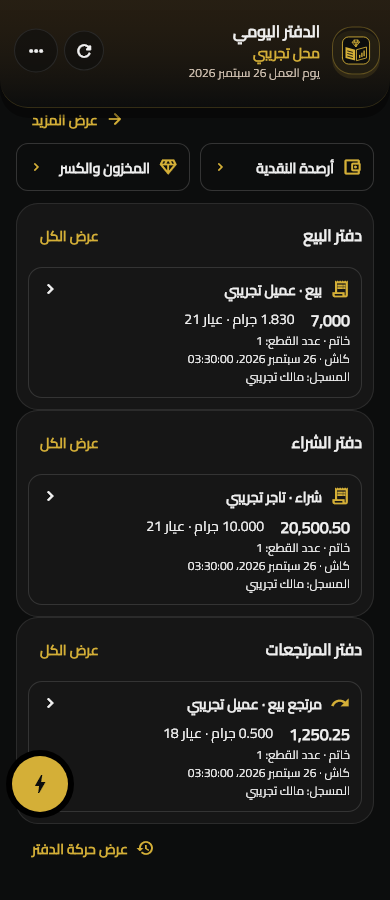
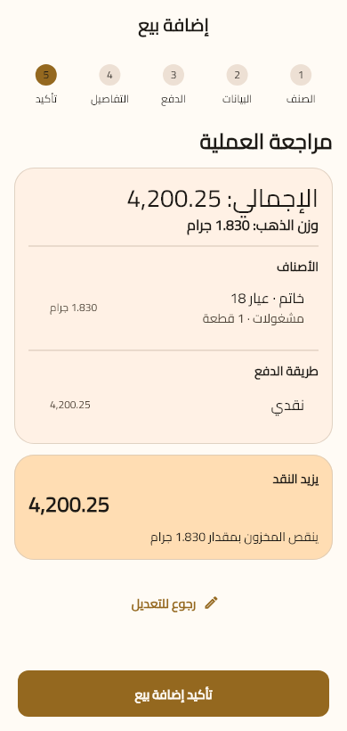

# Owner feedback correction and rollout review — 2026-10-06

This review checks all eight pages of the owner's PDF comments and both original Arabic voice notes against the current implementation. Document text was treated as product feedback, not agent workflow instructions. Private references remain excluded from repository artifacts. The earlier [completion report](../owner-feedback-2026-10-05/completion.md) and later [compact-ledger review](../compact-ledger-2026-10-05/validation.md) are historical evidence, not proof of current or hosted completion.

## Gaps corrected

The later compact home had replaced the requested visible books with mixed recent activity and reduced customization to four metrics. The registration form's in-progress manual-region changes still required a region, and Edge/SQL rejected country-only profiles. The operation review lacked a grouped invoice summary and the floating menu lacked a linked-return entry point.

- Restore separate sale and purchase books on home. Each shows at most three recent cards; nonempty enabled returns show one card. Each book opens its own filtered full history, including older-record loading. Other movements remain accessible in full history. Home length stays bounded with 200 loaded records.
- Expose all eight metric visibility and order controls, including cash and gold. Home shows the first six selected metrics; more opens the remaining selected figures and daily breakdowns. Existing per-shop preferences remain compatible, with shop-switch reset and recovery through customization.
- Make the region optional manual text for every supported country, including Egypt. An omitted region submits `CC:` to preserve country, dial-code and shop-time-zone derivation. Populated regions use `CC:label`; legacy Egyptian ISO codes remain accepted. Flutter, Edge and SQL agree on length, controls and whitespace boundaries. Service-only RPC privileges and changed-profile replay rejection remain.
- Preserve the existing registration edits: short name/shop labels, separate contacts, editable account/shop review groups, step navigation and retained input. Unknown outcomes keep original request data locked for reconciliation.
- Group operation total, gold weight, items, payments and optional client/note in a neutral invoice-style card before exact net cash and inventory effects. Keep clear edit/confirmation controls; no invoice number is invented before posting. Simplify the in-flight save label.
- Replace remaining inventory “مراجعة الأثر”/command labels with operation language, and simplify financial save/retry copy across inventory, opening, close-day, transfers, settlement and linked returns. Messages no longer expose internal keys or technical rejection codes. Pending outcomes stay explicitly unconfirmed and keep their original retry payloads.
- Wrap journal facts at narrow widths, retaining the recording owner, item/count, exact money, three-decimal weight, karat, split-payment label and server-provided shop time. No employee roles were introduced.
- Add “إضافة مرتجع” to supported quick actions while the signed-in owner has write access and an open day. It selects an original confirmed sale or purchase and opens its existing operation/linked-return workflow. Return-source history omits prior returns and unrelated movements; no mutation occurs during selection. Closed/expired/pending access does not expose the action.

## Complete product coverage

| Owner request | Current local behavior |
| --- | --- |
| Simple login, direct shop entry, no guides | Logo/title, supported email-or-phone identifier, password and direct authentication controls. Active owner shop opens the ledger. Tours, guide/help cards and practice entry points remain removed. |
| Short signup labels and separate contacts | “الاسم”, “اسم المحل”, independent email/phone, three registration-data steps and editable review. |
| Country flags and automatic dial codes | Packaged Arabic country selector for 22 supported Arab-region countries; international paste updates the selection. |
| Optional manually typed region | Implemented across Flutter, Edge and SQL for Egypt and international countries. |
| Reference visual direction and font | Existing Cairo and shared brown/cream/charcoal/gold tokens retained. Rendered Arabic RTL screens reviewed in both themes. |
| Three separate visible books | Sales/purchases on home, smaller optional nonempty returns, full per-book history. |
| Customizable top insights | All eight hide/reorder controls persist per shop; first six visible figures appear at the top by default. |
| Draggable quick actions | Existing per-shop safe position, dragging and four corner-position controls retained; linked return added. |
| Sequential sale and purchase slides | Category → items → payment → optional details → review → server-confirmed success. |
| Roughly twelve standard item types | Existing named choices include rings, bands, bangles, bracelets, anklets, sets, coins and bullion; purchases add scrap. Known choices require no typed name; “أخرى” offers optional custom naming. |
| Optional customer in sale/purchase | Preserved for fully paid, partial and unpaid purchases. Unnamed payables remain operation-specific, with idempotent posting, settlement and linked returns covered by SQL gates. |
| Readable currency-free amounts | Comma grouping, no unnecessary `.00`, exact genuine cents and no currency suffix; gold keeps three decimals. Gold-coin item names remain category names. |
| Invoice-style operation review | Grouped business summary precedes net effects, with edit and confirm actions and no pre-save invoice number. |
| Recording person and item/count information | Journal cards show the audited recording owner and item/count summaries alongside transaction facts. |
| Dark startup and saved light option | Existing fresh dark default and persisted choices retained in both clients. |
| Brand title and logo | Existing open-ledger/diamond mark and “دفتر لإدارة محلات الذهب والمجوهرات” retained. |

## Validation

Final results from this run are recorded below. No release builds, React production build, publishing or deployment are part of this run.

- Scoped Dart formatting and Flutter analysis: no issues.
- Full Flutter regression and capture suite: **426 passed**; **23 inventory widget/capture tests passed** after the final wording repairs. The long-history, paging, shop-switch, optional-region, return-entry, anonymous-payable and exact-precision paths remain covered.
- React lint, 37 tests across nine files, and `npx tsc -b`: passed. React source/tokens were unchanged.
- Deno owner-registration function suite: 24 passed. This covers every supported country's optional region, malformed location/phone rejection, replay and auth boundaries.
- All migrations replayed in a newly initialized disposable PostgreSQL 17.11 cluster on localhost port 55437. All ten registration/identity/RLS/opening/trade/pricing/inventory SQL suites passed with rollback-only fixtures. No hosted financial fixtures or migrations were applied.
- Arabic RTL rendering reviewed at 320, 390 and 1440 widths in both themes: auth/shop/review, summary/customization, separate journals/history, return-source selection and sale invoice review; inventory review was checked at 320 and 1440 in both themes. Screens use synthetic gateways and data; no private source images are saved here. Existing native flag evidence remains historical.
- Local link, source-exclusion and whitespace review: passed. Source PDFs/transcripts, build captures, SQL logs and the disposable cluster remain excluded.

## Hosted state and concrete rollout

A read-only migration inventory of the connected development project on 2026-10-06 confirmed that neither October 5 owner-feedback migration is applied. The new optional-region migration is also local. This is a deployment gap as well as the local UI regressions above: local tests cannot make the running backend accept international/country-only registration or unnamed unpaid purchases.

To release these changes, apply the reviewed migrations in order:

1. [`20261005071930_owner_feedback_registration_and_ledger.sql`](../../../supabase/migrations/20261005071930_owner_feedback_registration_and_ledger.sql): international profile validation, location/time-zone derivation and journal summaries.
2. [`20261005091822_complete_owner_feedback.sql`](../../../supabase/migrations/20261005091822_complete_owner_feedback.sql): unnamed purchase payables and item/count journal data.
3. [`20261006063258_optional_owner_registration_region.sql`](../../../supabase/migrations/20261006063258_optional_owner_registration_region.sql): optional regions with country/phone validation intact.
4. Deploy the reviewed [`owner-register`](../../../supabase/functions/owner-register/index.ts) Edge Function after the SQL changes.
5. Verify hosted migration/function state and the real registration/ledger paths, then distribute an updated client through the separately authorized release process.

Deployment was not authorized in this request. [AGENTS.md](../../../AGENTS.md) states: “Neither agent should publish or deploy without direct authorization.” The workspace changes and this ordered rollout are the concrete reviewable result for approval. New Android/iOS/Windows native execution, hosted Auth registration, app distribution and final owner visual acceptance remain unverified in this run. The existing emulator evidence does not establish new native or hosted acceptance.

## Evidence

[Current screen captures](screens) show actual Flutter-rendered UI. Historical screenshots and validation records were preserved.

## Later authorized development deployment — 2026-10-06

The preceding local review and its deployment-pending statement describe the earlier run and remain historical. The owner subsequently authorized only the three reviewed migrations and `owner-register` for development `xchapwvmvoefriqcxtvn`.

[Deployment and verification record](deployment.md): migrations applied as hosted versions `20261006072226`, `20261006072242`, `20261006072259`; all stored SQL exactly matched reviewed sources. `owner-register` version 2 is active and its runtime files match the checkout. Ten hosted rollback SQL suites, real Saudi/Egypt registration and two-identifier Auth checks, client response decoding, 426 Flutter tests, 37 React tests, 24 Edge tests and two synthetic Android debug harnesses passed. The two real synthetic registration actors were signed out, banned and membership-revoked; their immutable audits remain. Original financial counts are unchanged.

Native-to-hosted financial acceptance, network fault/race testing, other-country real Auth coverage, legacy-key registration, Windows/iOS/device execution, fresh dark splash, owner acceptance and application distribution remain open. See the detailed record for exact limitations and advisor findings. No application was distributed and no release/production build, commit, push or data reset occurred.
